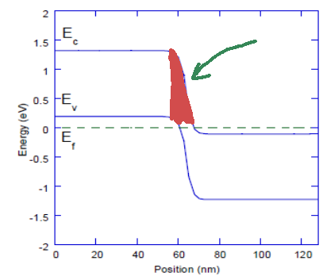

# Введение

Туннельные диоды были открыты учёным Эсаки и используют эффект квантового туннелирования электронов через потенциальный барьер.

Этот эффект связан с волновой природой электронов, благодаря которой они могут попадать в классически запрещённые области.

Существует несколько видов туннельных диодов. Наиболее типичные сделаны на основе PN-переходов (рис. 1), но есть и другие (например, резонансно-туннельные диоды, диоды на основе свехрешёток и т.д.)

![Рисунок 1. Схема туннельного диода Эсаки [1].](images/esaki.png){width=400px}

$$ $$

Туннельные диоды известны тем, что на их ВАХ наблюдается область отрицательного дифференциального сопротивления (отрицательной дифференциальной проводимости --- ОДП). Дифференциальная проводимость определяется как:

$$ \Omega_{d}=\frac{dI}{dV} $$
Обычная проводимость --- отношение тока к напряжению --- не может быть отрицательной, а дифференциальная может. При этом ток положительный, но начинает падать при росте напряжения. Это можно видеть на рис. 2.

![Рисунок 2. ВАХ туннельного диода [1].](images/iv-curve.png){width=300px}

$$ $$

Участок ОДП может быть использован для генераторов переменного тока (генераторов колебаний), потому что он позволяет компенсировать внутреннее сопротивление цепи и избежать затухания колебаний.

# Обзор литературы

Ток через туннельный диод можно рассчитать по формуле Эсаки [2].

$$I(V)=\frac{em_{e}kT}{2\pi^{2}\hbar^{3}}\int_{0}^{\infty}T_{c}\left(E_{\perp}\right)\left[\ln\left(1+\exp\frac{E_{Fn}+eV-E_{\perp}}{kT}\right)-\ln\left(1+\exp\frac{E_{Fp}-E_{\perp}}{kT}\right)\right]\mathrm{d}E_{\perp}$$
Где $T_c$ --- вероятность (коэффициент) прохождения электронов через барьер, $E_{\perp}$ --- кинетическая энергия электронов в направлении границы между P и N областями, которая отсчитывается от дна зоны проводимости $E_c$.

Логарифмы описывают распределение электронов по энергиям в P и N областях.

Для работы туннельного диода области N и P должны быть сильно легированы, то там должно быть очень много примесей. Тогда при $V=0$ уровни Ферми будут находится внутри зоны проводимости в N области и внутри валентной зоны в P области, как изображено на рис. 3а.

![Рисунок 3. Зонная структура туннельного диода при а) $V=0$ и b) $V>0$ [3].](images/diode-scheme-2.png){width=500px}

$$ $$

Вероятность прохождения барьера может быть рассчитана с помощью квантовой механики для барьеров любой формы. В данном случае барьер похож на треугольный (рис. 4), но можно его считать и прямоугольным. При повышении напряжения уровни Ферми будут смещаться друг относительно друга и барьер между P и N областями будет уменьшаться (рис. 3b).

{width=250px}

$$ $$

Самый простой вид имеет коэффициент прохождения для очень узкого барьера в виде дельта-функции:

$$U(x)=\alpha \delta(x),\qquad \alpha = Ha \tag{2}$$
где $H$ --- высота барьера в единицах энергии (эВ), а $a$ --- ширина барьера (например, в нм).

Для неё вероятность прохождения имеет вид:

$$T_c(E)=\frac{E}{E+\frac{m_e \alpha^2}{2\hbar^2}} \tag{3}$$

# Основные формулы

## Константы

| Обозначение | Формула | Переменная | Значение | Единицы | 
| :---: | :---: | :---: | :---: | :---: |
| $k$ | $k$  | k_boltzmann  | 8.62e-5  | эВ$\cdot$K$^{-1}$  |
| $q$ | $\displaystyle \frac{e}{\hbar}$  | e_h  | 2.43e-4  | А$\cdot$эВ$^{-1}$ |
| $K$ | $\displaystyle \frac{\hbar^2}{m_0}$  | h2_m0  | 0.0762  | эВ$\cdot$нм$^2$  |
| $C$ | $\displaystyle \frac{e^2}{4\pi \varepsilon_0}$  | e2_4pieps0  | 1.44  | эВ$\cdot$нм  |

## Исходные параметры

| Величина  | Обозначение | Переменная | Диапазон | Значение | Единицы | 
| :---: | :---: | :---: | :---: | :---: | :---: |
| Ширина запр. зоны  | $E_g$  | band_gap  | 0.2 -- 2  | 1.12  | эВ  |
| Эфф. масса эл.  | $m_e$  | eff_mass_e  | 0.01 -- 1  | 0.19  | $m_0$  |
| Эфф. масса дыр.  | $m_h$  | eff_mass_h  | 0.01 -- 1  | 0.49  | $m_0$  |
| Диэлектр. прониц.  | $\varepsilon$  | dielectric  | 1 -- 15  | 11.7  | -  |
| Температура  | $T$  | temperature  | 4 -- 400  | 300  | К  |
| Конц. доноров  | $N_d$  | donor_conc  | 1e-4 -- 0.1  | 0.1  | нм$^{-3}$  |
| Конц. акцепторов  | $N_a$  | accept_conc  | 1e-4 -- 0.1  | 0.1  | нм$^{-3}$  |

## Вторичные параметры

| Обозначение | Формула | Переменная | Единицы | 
| :---: | :---: | :---: | :---: |
| $N_c$ | $\displaystyle 2 \cdot \left( \frac{m_e kT}{2\pi K} \right)^{3/2}$  | n_c  | нм$^{-3}$  |
| $N_v$ | $\displaystyle 2 \cdot \left( \frac{m_h kT}{2\pi K} \right)^{3/2}$  | n_v  | нм$^{-3}$  |
| $E_{Fn}-E_c$ | $\displaystyle kT \ln \left( \frac{N_d}{N_c} \right)$  | fermi_n  | эВ  |
| $E_{Fp}-E_v$ | $\displaystyle kT \ln \left( \frac{N_v}{N_a} \right)$  | fermi_p  | эВ  |
| $\Delta \Phi$ | $\displaystyle E_{Fn} - E_c -\left(E_{Fp} - E_v \right) +E_g$  | delta_phi  | эВ  |
| $W^3$ | $\displaystyle \frac{\pi C K k T}{m_e} \frac{N_a N_d}{N_a+N_d}$  | transmission_parameter  | эВ$^3$  |
| $A$ | $\displaystyle \frac{q m_e k^{2}T^{2}}{2\pi^2K}$  | richardson_constant  | A$\cdot$нм$^{-2}$  |

### Пояснение параметров

$$2 \cdot \left( \frac{m_e m_0 kT}{2\pi \hbar^2} \right)^{3/2} = 2 \cdot \left( \frac{m_e kT}{2\pi K} \right)^{3/2}$$

$$2 \cdot \left( \frac{m_h m_0 kT}{2\pi \hbar^2} \right)^{3/2} = 2 \cdot \left( \frac{m_h kT}{2\pi K} \right)^{3/2}$$

$$E_{Fn}-E_{Fp} = E_{Fn} - E_c -\left(E_{Fp} - E_v \right) +E_c-E_v= E_{Fn} - E_c -\left(E_{Fp} - E_v \right) +E_g$$

$$W^3 = \frac{e^{2}}{4\varepsilon_{0}\varepsilon}\frac{\hbar^{2}kT}{m_{e}}\frac{N_{a}N_{d}}{N_{a}+N_{d}}$$

$$A = \frac{1}{2\pi^2} \frac{e}{\hbar} \frac{m_e k^{2}T^{2}}{\hbar^2} = \frac{q m_e k^{2}T^{2}}{2\pi^2K}$$

## Окончательные формулы

### Общий ток

$$I\left(V\right)=I_{1}\left(V\right)+I_{2}\left(V\right)$$

### Туннельный ток

$$I_{1}\left(V\right)=A\int_{0}^{b}\frac{u\ln\left(1+w_{0}e^{-u}\right)}{u+\left(\Delta\Phi-eV\right)^{3}/W^{3}}du$$

### Диодный ток

$$I_{2}\left(V\right)=A\cdot s_{0}\left[\exp\left(\frac{eV}{kT}\right)-1\right]$$

### Параметры

$$w_{0}=\exp\frac{E_{F}-E_{c}}{kT}$$
$$s_{0}=\exp\frac{E_{F}-E_{c}-\Delta\Phi}{kT}$$

Верхний предел интегрирования туннельного тока станет равным нулю для предельного значения напряжения, после которого туннелирование полностью прекратится. После этого надо учитывать только диодный ток.

$$b=\frac{\Delta\Phi-E_{g}-eV}{kT}>0,\qquad eV<\Delta\Phi-E_{g}$$

# Литература

1. Leo Esaki. Long Journey into Tunneling. Science, 22 March 1974, Volume 183, Number 4130.
1. N. Moulin, Mohamed Amara, F. Mandorlo, M. Lemiti. Tunnel junction I ( V ) characteristics: Review and a new model for p-n homojunctions. Journal of Applied Physics, 2019, 126 (3), pp.033105. 10.1063/1.5104314. hal-03035269
1. Messaadi Lotfi and Dibi Zohir. A Spice Behavioral Model of Tunnel Diode: Simulation and Application. International Journal of Control and Automation Vol. 9, No. 4 (2016), pp. 39-50 http://dx.doi.org/10.14257/ijca.2016.9.4.05
1. D. Mtn, M. PATIL, J. CHEN. Solid-State ElectronicsVol. 32, No. 1I, pp. 1025-1031, 1989
